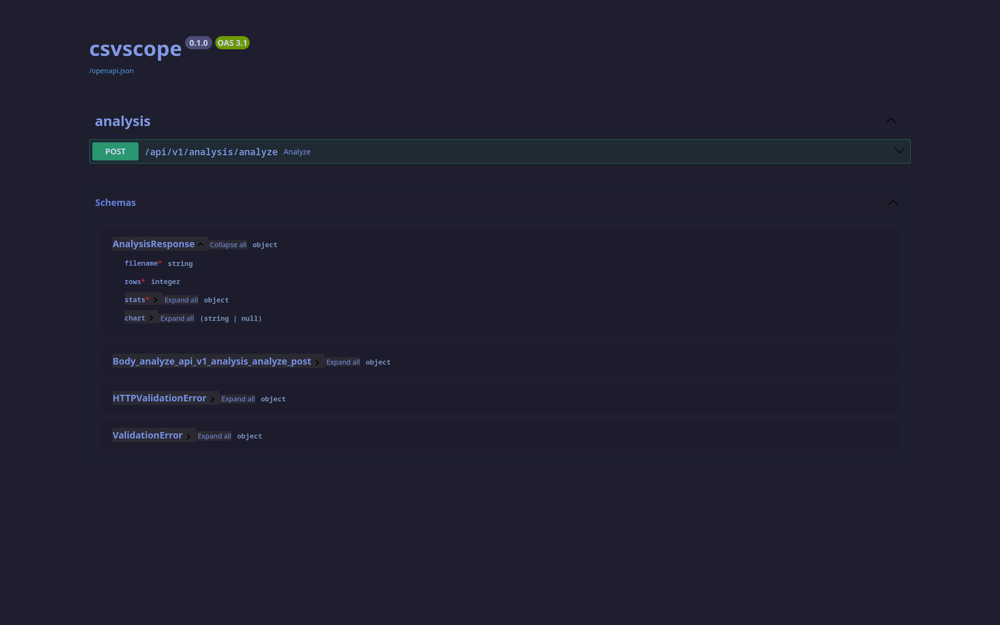
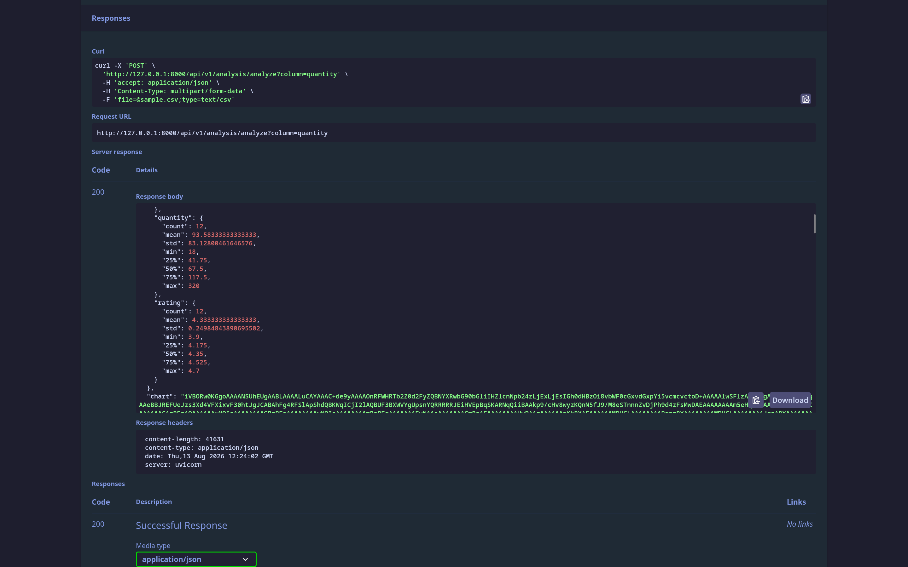
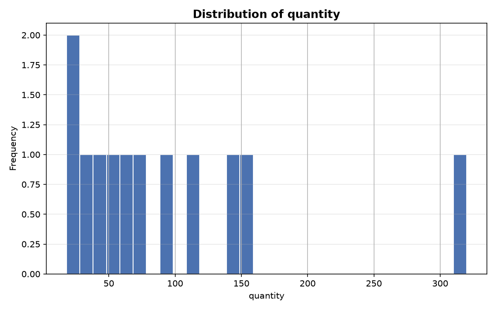

# csvscope

A FastAPI backend that analyzes uploaded CSV files and returns summary statistics
and an auto-generated chart in a single JSON response — even when the file
contains missing or invalid values.

Built to demonstrate backend and data analysis skills together: FastAPI for the
API layer, pandas for the analysis engine, and matplotlib for chart generation —
structured with a clean, modular architecture (routers/services/models) suitable
for real-world use.

---

## Features

- Upload any CSV and get instant summary statistics (count, mean, std, min, max, quartiles) for every numeric column
- Auto-generated histogram chart, returned as base64 — no separate download step
- Chart column is selectable via a query parameter, defaulting to the first numeric column
- Handles missing/invalid data gracefully instead of crashing
- File type validation with clear error messages
- Interactive, self-documenting API via Swagger UI
- Tested with `pytest`

---

## Project Structure

```
csvscope/
│
├── routers/
│   ├── __init__.py
│   └── analysis.py            # POST /api/v1/analysis/analyze
│
├── services/
│   ├── __init__.py
│   ├── analyzer.py            # CSV parsing + summary stats (pandas)
│   └── chart_builder.py       # chart generation + base64 encoding (matplotlib)
│
├── models/
│   ├── __init__.py
│   └── response.py            # Pydantic response schema
│
├── core/
│   ├── __init__.py
│   └── exceptions.py          # custom API exceptions
│
├── utils/
│   ├── __init__.py
│   └── validators.py          # file type validation
│
├── tests/
│   ├── __init__.py
│   ├── sample.csv
│   └── test_analysis.py
│
├── screenshots/
├── .gitignore
├── LICENSE
├── main.py
├── requirements.txt
└── README.md
```

---

## How to Run

**1. Clone the repo**

```bash
git clone https://github.com/maniesh-lab/csvscope
cd csvscope
```

**2. Create and activate a virtual environment**

```bash
python -m venv venv
source venv/bin/activate
```

**3. Install dependencies**

```bash
pip install -r requirements.txt
```

**4. Start the server**

```bash
uvicorn main:app --reload
```

**5. Try it out**

Visit `http://127.0.0.1:8000/docs` and upload a CSV directly in the browser.

---

## API Docs



---

## Example Request

```bash
curl -X POST "http://127.0.0.1:8000/api/v1/analysis/analyze?column=quantity" \
  -H "accept: application/json" \
  -H "Content-Type: multipart/form-data" \
  -F "file=@your_file.csv;type=text/csv"
```

## Example Response

```json
{
  "filename": "sample.csv",
  "rows": 12,
  "stats": {
    "price": {
      "count": 12,
      "mean": 76.66,
      "std": 70.66,
      "min": 9.99,
      "25%": 33.74,
      "50%": 47.49,
      "75%": 99.99,
      "max": 249.99
    }
  },
  "chart": "iVBORw0KGgoAAAANSUhEUgA..."
}
```





---

## Tech Stack

| Tool | Purpose |
|---|---|
| `fastapi` | API framework |
| `pandas` | CSV parsing and statistics |
| `matplotlib` | Chart generation |
| `pydantic` | Response validation and schema |
| `pytest` | Testing |

---

## Use Case

Built for small businesses and analysts who need quick statistical insights from
raw CSV data without opening Excel or writing custom analysis scripts — upload a
file, get numbers and a chart back in seconds..

---

## Notes

- Chart column can be specified via `?column=column_name` in the request; defaults to the first numeric column if omitted
- Non-CSV files are rejected with a `400` error
- All processing happens in-memory — no files are written to disk

---

## Running Tests

```bash
pytest
```

---

## Author

**Manish Pandeya** · [github.com/maniesh-lab](https://github.com/maniesh-lab)